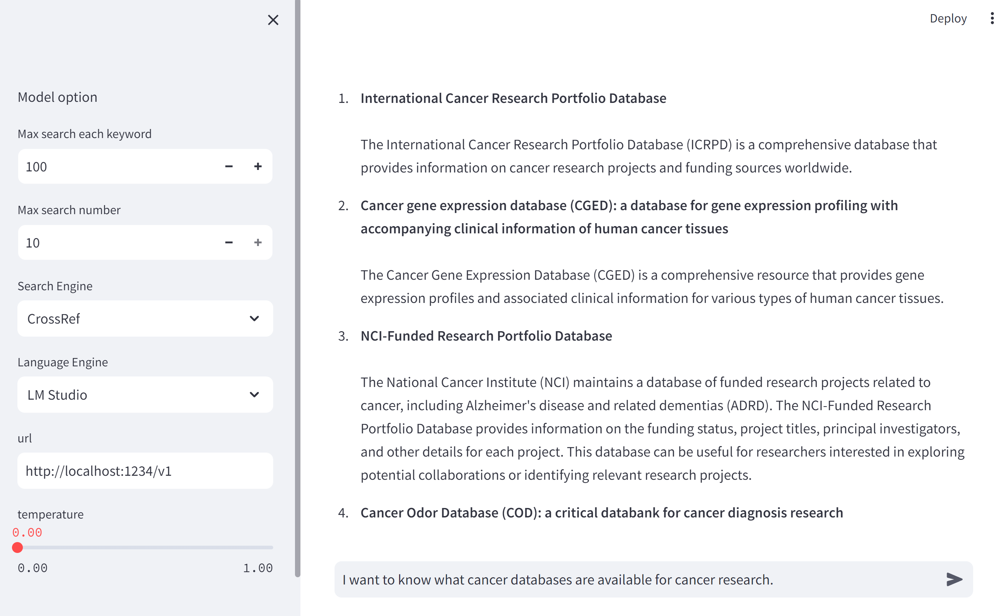

Tired of search literatures for finding a specific information? This is a tool for you. scholarGPT uses large language model and search API to find the most relevant information for your query. It is a simple tool that can be used by anyone.

## Demo




## Usage
1. Install the requirements
```
pip install -r requirements.txt
```
2. Obtaining the openAI API key or starting a LM studio server locally if you prefer a free model.
3. Run the following python code to start the server
```
import scholarGPT
scholarGPT.run_server()
```